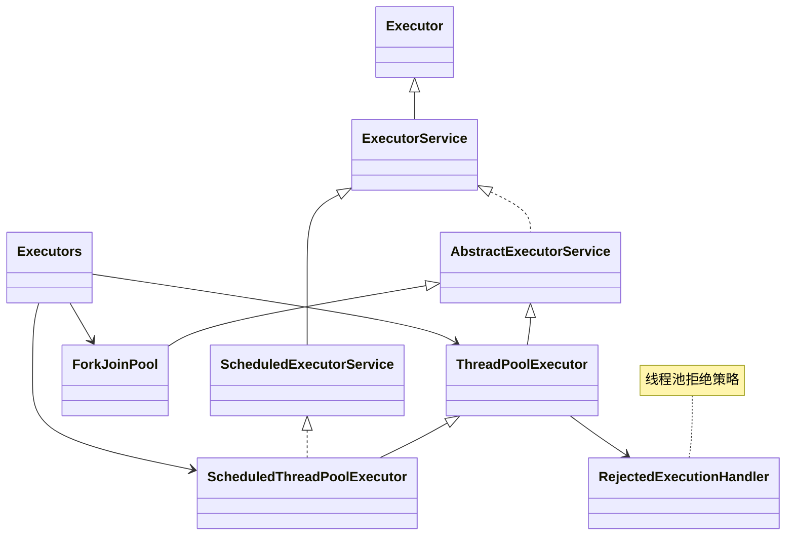

```mermaid

classDiagram

Executor <|-- ExecutorService

ExecutorService <|-- ScheduledExecutorService

ExecutorService <|.. AbstractExecutorService

AbstractExecutorService <|-- ForkJoinPool

AbstractExecutorService <|-- ThreadPoolExecutor

ThreadPoolExecutor --> RejectedExecutionHandler

note for RejectedExecutionHandler "线程池拒绝策略"

ThreadPoolExecutor <|-- ScheduledThreadPoolExecutor

ScheduledExecutorService <|.. ScheduledThreadPoolExecutor

Executors --> ForkJoinPool

Executors --> ThreadPoolExecutor

Executors --> ScheduledThreadPoolExecutor

```
